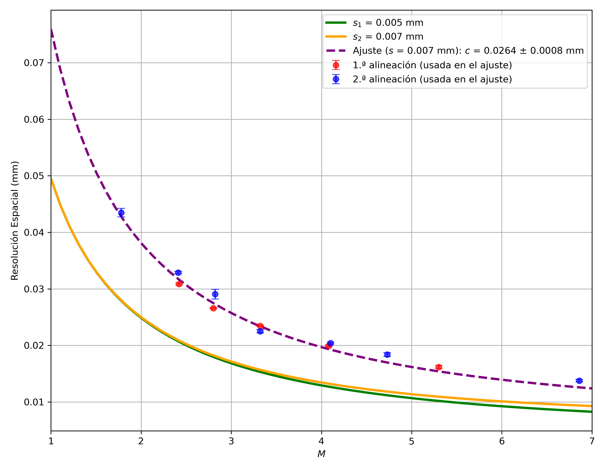

# Parametrización Geométrica y Resolución Espacial de un Microtomógrafo de Rayos X de Arquitectura Abierta

Código, macros y datos de ejemplo de mi trabajo final de Licenciatura en Física (FaMAF, Universidad Nacional de Córdoba, 2026): métodos para **caracterizar un microtomógrafo de rayos X de arquitectura abierta**, midiendo sus parámetros geométricos y su resolución espacial.



## Resumen

El trabajo determina, a partir de radiografías, (i) los parámetros geométricos del sistema (desalineación del punto principal, rotación del detector, ángulo η, distancias foco-detector y foco-objeto) y (ii) la resolución espacial, definida como la frecuencia donde la MTF cae al 10 %, para distintas magnificaciones. Incluye además el preprocesado de las proyecciones.

El flujo de trabajo es siempre el mismo: **macros de Fiji/ImageJ extraen datos de las imágenes** (tablas `.csv`), **scripts de Python los analizan** y generan las figuras y los parámetros finales.

## Contenido

| Carpeta | Qué determina | Herramientas |
|---|---|---|
| [`01_cone_projection`](analyses/01_cone_projection) | Desalineación del punto principal y ángulo de rotación del detector, a partir de la proyección del cono del haz | Fiji |
| [`02_cylinder_eta`](analyses/02_cylinder_eta) | Ángulo η y desalineación entre el eje de magnificación y el eje de movimiento del portamuestras, con dos proyecciones de un cilindro a 180° | Fiji |
| [`03_sphere_centroids`](analyses/03_sphere_centroids) | Calibración geométrica completa (D, V₀, U₀, η, F) a partir de las trayectorias elípticas de los centroides de esferas | Fiji + Python |
| [`04_spatial_resolution_mtf`](analyses/04_spatial_resolution_mtf) | Resolución espacial (MTF al 10 %), por dos métodos, y su dependencia con la magnificación | Fiji + Python |
| [`05_projection_preprocessing`](analyses/05_projection_preprocessing) | Corrección de campo plano y de la deriva temporal de la intensidad del haz | Fiji |

Cada carpeta tiene su propio `README.md` con el orden de ejecución.

## Cómo reproducirlo

Requisitos: **Python 3.12** (probado) y **[Fiji](https://fiji.sc)** para los macros `.ijm`.

```bash
git clone https://github.com/mateosironi/XRay_microCT.git
cd XRay_microCT

python -m venv .venv
.venv\Scripts\activate          # Windows  (Linux/macOS: source .venv/bin/activate)
pip install -r requirements.txt

python analyses/03_sphere_centroids/pipeline_calibracion.py
```

Los scripts resuelven sus rutas respecto de su propia ubicación, así que pueden ejecutarse desde cualquier directorio. Los macros se ejecutan desde Fiji con *Plugins ▸ Macros ▸ Run…*.

## Datos

- Los archivos incluidos en las carpetas `.data` son solo muestras para utilizar los macros `.ijm` y los scripts de Python.
Son tan solo una fracción reducida de todos los datos utilizados en la investigación
- Los **archivos `.csv`** (tablas extraídas con los macros) están incluidos y son la entrada de los scripts de Python: se puede reproducir el análisis sin las imágenes.
- De las **imágenes `.tif`** solo se incluyen algunas muestras, suficientes para probar los macros. El conjunto completo de imágenes no está en el repositorio. En algunos casos, como [`03_sphere_centroids`](analyses/03_sphere_centroids), las imágenes provistas solo
sirven como muestra para probar los macros, pero no son suficientes para obtener los archivos `.csv` necesarios para el análisis.

## Estructura

```text
.
├── README.md
├── requirements.txt
├── .gitignore
├── .gitattributes
└── analyses/
    ├── 01_cone_projection/
    │   ├── proyeccion_cono.ijm
    │   └── data/
    ├── 02_cylinder_eta/
    │   ├── analisis_cilindro.ijm
    │   └── data/
    ├── 03_sphere_centroids/
    │   ├── centroides_esferas.ijm
    │   ├── config.py
    │   ├── 01_fit_elipses.py  02_puntos_de_interes.py  03_calibracion.py
    │   ├── pipeline_calibracion.py  plot_centroides.py  div_elipses.py
    │   ├── data/              # tabla_centroides.csv y sample_images/
    │   └── resultados/
    ├── 04_spatial_resolution_mtf/
    │   ├── perfiles.ijm  cortes_radiales.ijm  resolucion_vs_magnificacion.py
    │   ├── multiples_perfiles/        # método numérico, varios perfiles
    │   ├── perfil_unico_analitico/    # método analítico, un perfil
    │   └── resultados/
    └── 05_projection_preprocessing/
        ├── 01_FFC.ijm
        ├── 02_correccion_temporal.ijm
        └── data/              # Darks/, Flats/, proyecciones/
```

## Informe

El informe completo (LaTeX y PDF) está en [`thesis/`](thesis).

## Licencia

- **Código** (`.py`, `.ijm`): licencia MIT, ver [`LICENSE`](LICENSE).
- **Informe, figuras y datos de ejemplo**: [Creative Commons Atribución-NoComercial-CompartirIgual 4.0 Internacional](https://creativecommons.org/licenses/by-nc-sa/4.0/deed.es).

## Cómo citar

Sironi M., Tirao G. (2026). *Parametrización geométrica y resolución espacial de un microtomógrafo de rayos X de arquitectura abierta*. Trabajo final de Licenciatura en Física, FaMAF, Universidad Nacional de Córdoba. Código: https://github.com/mateosironi/XRay_microCT

## Contacto

Mateo Sironi — [LinkedIn](https://www.linkedin.com/in/mateo-sironi-13019525a)
