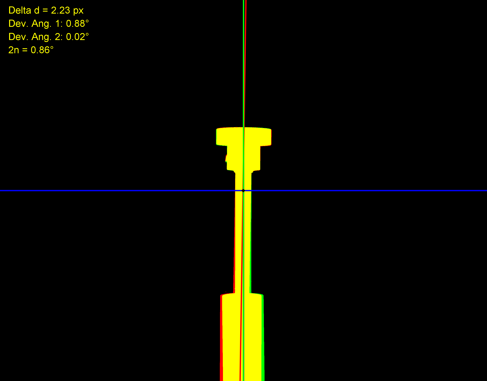

# 02 · Cilindro: ángulo η y desalineación del eje de magnificación

Calcula, con el macro de Fiji `analisis_cilindro.ijm`, el **ángulo η** y la **desalineación entre el eje de magnificación y el eje de movimiento del portamuestras**. Utiliza **dos proyecciones radiográficas de un objeto cilíndrico, desfasadas 180°** entre sí.

No requiere análisis posterior en Python: el resultado son directamente parámetros geométricos del sistema.

## Contenido

| Archivo | Descripción |
|---|---|
| `analisis_cilindro.ijm` | Macro de Fiji/ImageJ |
| `data/image_1.tif`, `data/image_2.tif` | Par de proyecciones de ejemplo |

## Entradas y salidas

| | Descripción |
|---|---|
| **Entrada** | Dos imágenes de proyecciones del cilindro, seleccionadas de forma interactiva al ejecutar el macro |
| **Salida (imagen)** | Imagen multicanal (*Merge*) con la superposición gráfica de los ejes |
| **Salida (reporte)** | Reporte de alineación impreso en la ventana *Log* de Fiji. `n` (o `eta`), el ángulo de inclinación del eje de rotación |

## Cómo usarlo

1. Abrir [Fiji](https://fiji.sc).
2. *Plugins ▸ Macros ▸ Run…* y elegir `analisis_cilindro.ijm`.
3. Seleccionar las dos proyecciones cuando el macro lo pida (`data/image_1.tif` y `data/image_2.tif`).
4. Revisar la imagen *Merge* y el reporte en la ventana *Log*.

## Contexto

Complementa a [`01_cone_projection`](../01_cone_projection) y al método general con esferas de [`03_sphere_centroids`](../03_sphere_centroids).
