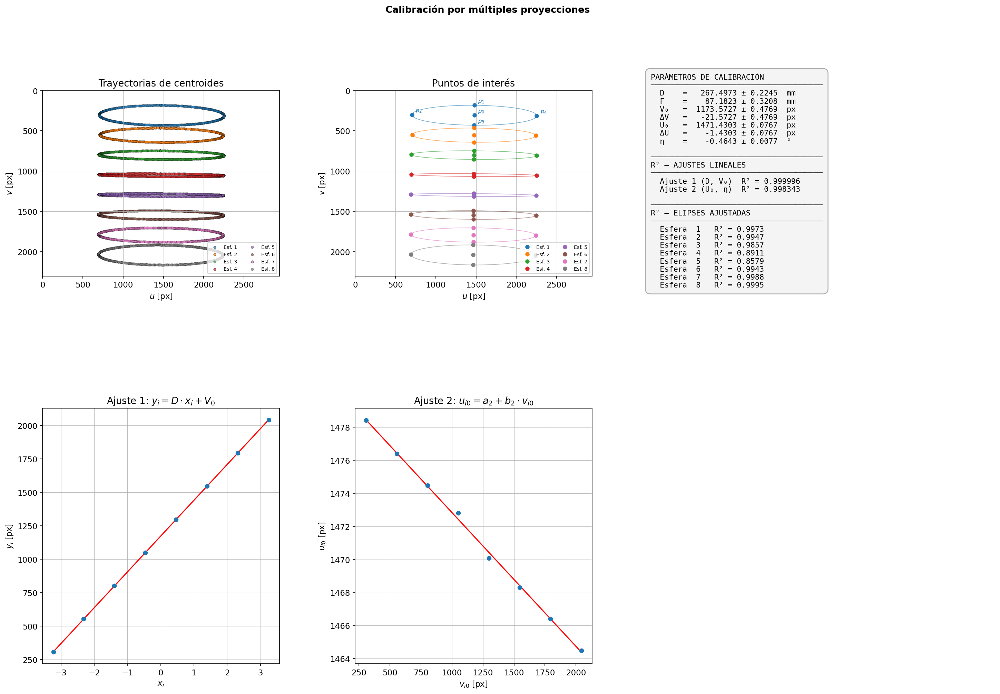

# 03 · Calibración geométrica con esferas

Determina los parámetros geométricos del sistema a partir de las **trayectorias elípticas de los centroides de N esferas metálicas** (fantoma cilíndrico) a lo largo de la rotación, siguiendo el método de calibración por múltiples proyecciones de Yang et al. (referencia completa en el informe).

**Parámetros que se obtienen, con incertidumbres:**

| Símbolo | Significado |
|---|---|
| D | distancia foco-detector |
| V₀, U₀ | coordenadas (v, u) del punto principal |
| η | ángulo de inclinación del eje de rotación |
| F | distancia foco-objeto |



## Flujo de trabajo

```text
proyecciones ──► centroides_esferas.ijm ──► data/tabla_centroides.csv ──► scripts de Python ──► resultados/
   (Fiji)                                    columnas X1,Y1,…,XN,YN [px]
```

1. **`centroides_esferas.ijm`** (Fiji) extrae las coordenadas (X, Y) del centroide de cada esfera en un stack de proyecciones. El umbral de binarización lo define el usuario sobre una imagen de referencia, y debe registrarse junto con los resultados.
2. **Python**, de dos formas equivalentes:

| Opción | Comando | Qué hace |
|---|---|---|
| Paso a paso | `python 01_fit_elipses.py` | Ajusta una elipse a cada trayectoria (mínimos cuadrados) y calcula el R² por rama |
| | `python 02_puntos_de_interes.py` | Calcula el centro y los cuatro vértices de cada elipse |
| | `python 03_calibracion.py` | Cambio de variables, dos ajustes lineales y cálculo de D, V₀, U₀, η y F |
| Todo junto | `python pipeline_calibracion.py` | Ejecuta los tres pasos y produce una figura resumen |

`plot_centroides.py` (opcional) grafica las trayectorias de los centroides. Los scripts pueden ejecutarse desde cualquier directorio.

## Archivos

| Archivo | Descripción |
|---|---|
| `config.py` | Configuración única: rutas, geometría del detector y parámetros del fantoma. También carga y valida la tabla de centroides |
| `div_elipses.py` | Función auxiliar (R² por rama) llamada por `01_fit_elipses.py` |
| `data/tabla_centroides.csv` | Entrada de Python: columnas `X1,Y1,X2,Y2,…,XN,YN` en píxeles |
| `data/sample_images/` | 15 proyecciones de ejemplo para probar el macro (ver nota) |
| `resultados/` | Salidas generadas: `parametros_elipses.csv`, `puntos_de_interes.csv` y las figuras `.png` |

> **Nota:** las imágenes de `sample_images/` son una muestra para probar `centroides_esferas.ijm`; **no reproducen** la tabla completa `tabla_centroides.csv`, que es la que usan los scripts.

## Configuración (`config.py`)

Los valores del repositorio corresponden al conjunto de datos de ejemplo. **Para otra adquisición, modificar únicamente `config.py`.**

| Constante | Valor de ejemplo | Significado |
|---|---|---|
| `ANCHO_PX` / `ALTO_PX` | 2940 / 2304 | tamaño del detector en u / v [px] |
| `DU`, `DV` | 0.0495 mm/px | tamaño de píxel |
| `L_REAL` | 28.0 mm | distancia entre el centro de la primera y de la última esfera |
| `ERR_L`, `ERR_PX` | 0.1 mm, 0.5 px | incertidumbres de `L_REAL` y de las distancias en imagen |

Al cargar la tabla, `config.py` verifica el orden de las columnas y avisa si hay coordenadas fuera del detector, señal habitual de `ANCHO_PX` y `ALTO_PX` intercambiados.
